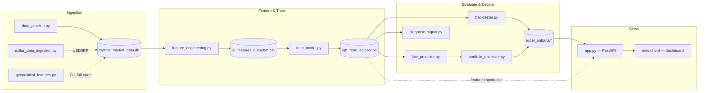

<div align="center">

# 📡 Signal Desk

### An end-to-end ML robo-advisor for the Tehran Stock Exchange — built around one rule:<br>never trust a Sharpe ratio you haven't tried to disprove.

[](https://www.python.org/)
[](https://fastapi.tiangolo.com/)
[](https://lightgbm.readthedocs.io/)
[](#-tech-stack)
[](#-the-honest-scorecard)
[-red)](#-the-honest-scorecard)
[](LICENSE)
[](#-contributing)

<br>


<sub>📸 placeholder — drop a real screen recording of the dashboard at <code>docs/assets/dashboard-preview.gif</code> (bilingual toggle + dark/light + live pipeline run make for a great 10s loop)</sub>

</div>

<br>

> [!WARNING]
> **This is not financial advice, and the model says so itself.** The latest full backtest reports a **Deflated Sharpe Ratio of 0.315** — below the 0.5 threshold, meaning the strategy's edge is **not statistically distinguishable from luck**. Net stock-picking alpha vs. an equal-weight basket is a genuine **+31.5%**, but macro/dollar timing dragged total returns well behind simply holding USD over the test window. Full numbers in [The Honest Scorecard](#-the-honest-scorecard) below. This project exists to demonstrate rigorous ML engineering, not to manage your money.

<br>

## 🌟 Overview

Most "AI stock picker" repos show you an equity curve, a raw Sharpe ratio, and stop there. That's not enough — a backtest with a good-looking curve can just as easily be the product of trying enough configs until one got lucky (Selection Bias), or a feature that's secretly encoding *which ticker* rather than *which signal*.

**Signal Desk** is a full pipeline — data ingestion → feature engineering → LightGBM training → backtesting → live inference → portfolio optimization → a live dashboard — purpose-built for a market that punishes naive ML: the **Tehran Stock Exchange (TSE)**. Iranian equities have quirks most trading-bot tutorials never see:

| Challenge | Why it breaks naive models |
|---|---|
| 📈 **Non-stationary nominal prices** | A decade of high inflation means raw price levels are meaningless across time — every level-based feature is secretly a "which year is it" detector. |
| 💰 **Capital increases** | Can crater a ticker's nominal price >30% overnight with zero economic loss — indistinguishable from a crash unless explicitly detected and adjusted for. |
| ⛔ **Trading halts** | A stock can go quiet for months and still generate a "strong buy" if you don't check for staleness. |
| 💵 **Dollar dependency** | Most industrials are priced against USD/IRR more than against their own fundamentals — so *relative* performance vs. the dollar matters more than absolute price. |
| 🌍 **Geopolitical risk** | Regional events can move the whole market in hours — a signal no price-only dataset captures. |

Rather than tune around these until the backtest looks nice, this project builds **diagnostic instruments first** — mutual information, regime-shift, ticker-leakage, and cross-sectional variance decomposition tests — and only trusts a feature once it survives all four. The same discipline was later applied to the deployment layer: see [🐛 Bugs We Actually Found](#-bugs-we-actually-found-not-hypothetical-ones).

<br>

## 📊 The Honest Scorecard

*From the latest full pipeline run — 8 tickers, 1395–1405 (≈10 years), 15,489 labeled rows.*

| Metric | Value | Read |
|---|---|---|
| **Deflated Sharpe Ratio** | `0.315` | 🔴 **NO-GO** — below the 0.5 "distinguishable from chance" threshold |
| Alpha vs. equal-weight basket | `+31.48%` | 🟢 Genuine net stock-picking skill |
| Alpha vs. USD/IRR (buy-and-hold) | `−359.91%` | 🔴 Macro/dollar timing lost badly this window |
| Total return (strategy) | `+131.68%` | vs. `+491.59%` just holding dollars |
| Max drawdown | `−31.29%` | — |
| Sharpe / Sortino / Calmar | `−0.07 / −0.11 / 4.21` | — |
| Walk-forward fold accuracy | `49.2% – 54.0%` | Baseline (always predict majority class) is `52.4%` |

> [!NOTE]
> Why publish a negative headline result? Because the alternative — reporting only the raw Sharpe or the flattering alpha number — is exactly the kind of selective reporting the Deflated Sharpe Ratio exists to catch. The [full technical report](docs/robo_advisor_report.docx) documents this in detail, including *why* the model is currently closer to a market-timing tool than a stock-picker (see the cross-sectional variance decomposition findings).

<br>

## ✨ Key Features

- 🧠 **Purged walk-forward CV with embargo** — no look-ahead leakage across the 60-day label horizon, verified with an explicit embargo window, not just a random split.
- 🔬 **Four independent signal-validity diagnostics** — Mutual Information, Regime-Shift, Ticker-Leakage, and Cross-Sectional Variance Decomposition all run *before* a feature is trusted, not after a backtest looks good.
- 📉 **Deflated Sharpe Ratio, not raw Sharpe** — the strategy evaluation layer explicitly corrects for Selection Bias and non-normal returns (Bailey & López de Prado, 2014).
- 🏗️ **Iran-market-specific plumbing** — automatic capital-increase detection & share adjustment, trading-halt/staleness filtering, dollar-relative feature normalization.
- 🌍 **Independent geopolitical risk brake** — a live Country Instability Index (via [WorldMonitor](https://ir.worldmonitor.app)) throttles equity allocation (up to 95% → 20%) completely outside the model's own predictions.
- ⚡ **Zero-build dashboard** — FastAPI serves a single-file HTML/CSS/vanilla-JS dashboard from the same origin. No npm, no bundler, no CORS headaches.
- 🌗🌐 **Bilingual, bi-theme UI** — Persian/English with automatic RTL/LTR switching via CSS logical properties, dark/light themes, both persisted. Charts and numeric scales deliberately **stay LTR** even in RTL mode — mirroring a trend line would misrepresent the data.
- 🛡️ **Fail-open vs. fail-fast, on purpose** — non-critical signals (geopolitical data) degrade to neutral values silently; critical paths (USD/IRR rate, stationary features) hard-stop with `RuntimeError` rather than silently poisoning training data.
- 🐛 **14 real bugs found and documented** — not a hypothetical "lessons learned" section. See below.

<br>

## 🏗️ Architecture



<details>
<summary>📄 <b>REST API surface</b> (7 endpoints, click to expand)</summary>
<br>

| Endpoint | Method | Purpose |
|---|---|---|
| `/api/rankings` | `GET` | Live symbol rankings — 3-class probabilities, alpha score |
| `/api/equity-curve` | `GET` | Backtest equity curve vs. USD/IRR benchmark |
| `/api/backtest-metrics` | `GET` | Full backtest metrics, including Deflated Sharpe Ratio |
| `/api/model-health` | `GET` | Per-fold CV metrics + feature importance (recomputed live from the trained model — never persisted by `train_model.py`, so this endpoint is the single source of truth) |
| `/api/portfolio/optimize` | `POST` | Live portfolio allocation for a given capital / risk appetite / horizon |
| `/api/pipeline/run` | `POST` | Runs `main.py` as a subprocess (⚠️ see [Security note](#-security-note)) |
| `/api/health` | `GET` | Output-file availability check |

</details>

<br>

## 🛠️ Tech Stack

| Layer | Tools |
|---|---|
| **Language** |  |
| **ML / Modeling** | LightGBM · scikit-learn · SciPy (`optimize`, `stats`) |
| **Data** | pandas · numpy · SQLite (WAL mode) |
| **Market Data** | [`pytse_client`](https://github.com/Glyphack/pytse-client) (TSE) · GitHub-hosted USD/IRR dataset · [WorldMonitor SDK](https://ir.worldmonitor.app) (optional) |
| **Backend / API** |  · uvicorn · Pydantic |
| **Frontend** | HTML5 · CSS3 (Logical Properties, no framework) · Vanilla JS (ES6+) · Chart.js (bundled locally — no CDN dependency) |
| **Artifacts** | Excel (`openpyxl`) · JSON |
| **DevOps** | Local venv today — containerization is on the [roadmap](#-roadmap) |

<br>

## 🚀 Getting Started

### Prerequisites
- Python **3.11+**
- Internet access (for TSE price data and the USD/IRR dataset)
- *(optional)* a [WorldMonitor](https://ir.worldmonitor.app/pro) API key for live geopolitical signal — the pipeline runs fine without one, the geo features just stay neutral

### Installation

> [!IMPORTANT]
> Use **one shared virtual environment** for the pipeline *and* the backend. `app.py` imports `pandas`/`lightgbm` directly, and `/api/pipeline/run` executes `main.py` with whatever Python started `uvicorn` — a separate, lighter backend-only venv will throw `ModuleNotFoundError` the moment something real gets called.

```bash
git clone https://github.com/your-username/signal-desk.git
cd signal-desk

python -m venv .venv
source .venv/bin/activate        # Windows (PowerShell): .venv\Scripts\Activate.ps1

pip install -r requirements.txt -r backend/requirements_backend.txt
```

### Configuration

```bash
# Optional — enables the live geopolitical risk brake instead of neutral placeholders
export WORLDMONITOR_API_KEY="wm_..."          # PowerShell: $env:WORLDMONITOR_API_KEY="wm_..."
```

### Run

```bash
# 1. Pull USD/IRR exchange-rate history (writes dollar_rates.csv + macro_data.db)
python dollar_data_ingestion.py

# 2. Run the full pipeline: ingest → features → train → predict → optimize
python main.py

# 3. Launch the API + dashboard (served from the same origin, no CORS setup needed)
cd backend
export PROJECT_ROOT="$(pwd)/.."               # PowerShell: $env:PROJECT_ROOT = (Resolve-Path "..").Path
uvicorn app:app --reload --port 8000
```

Open **http://localhost:8000** — that's the dashboard, served directly by FastAPI.

> [!TIP]
> Always set `PROJECT_ROOT` as an **absolute path**. A relative `..` resolves against the process's current working directory, not the file's location — reorganize your folders and it silently points at the wrong place. This bit us for real; see bug #10 below.

<br>

## 💻 Usage

**Pull live rankings:**
```bash
curl http://localhost:8000/api/rankings
```

**Request a live portfolio allocation:**
```bash
curl -X POST http://localhost:8000/api/portfolio/optimize \
  -H "Content-Type: application/json" \
  -d '{"capital": 50000000, "risk_appetite": "medium", "time_horizon": "mid"}'
```
```json
{
  "portfolio_weights": { "شپنا": 0.227, "فملی": 0.195, "وبملت": 0.227, "صندوق درآمد ثابت": 0.35 },
  "metrics": { "total_return": 1.3168, "sharpe_ratio": -0.07, "max_drawdown": -0.3129, "risk_exposure": 0.65 }
}
```

**...or from Python:**
```python
import requests

r = requests.post("http://localhost:8000/api/portfolio/optimize", json={
    "capital": 50_000_000,
    "risk_appetite": "medium",
    "time_horizon": "mid",
})
print(r.json()["portfolio_weights"])
```

**Trigger a full pipeline re-run from the dashboard itself** — the "▶ Run full pipeline" button `POST`s to `/api/pipeline/run` and streams progress through the five stages live.

<br>

## 🐛 Bugs We Actually Found (not hypothetical ones)

A running, honest log — not a sanitized "lessons learned" slide. A few favorites:

| # | Bug | Root cause | Fix |
|---|---|---|---|
| 1 | **Train/serve skew** | `live_predictor.py` never called the same feature-correction function `train_model.py` and `backtester.py` did — the model's #1 most important feature was silently `0.0` on every live prediction | Single source of truth: all three now `import` the same function from `train_model.py` |
| 2 | **Strong-buy on a dead ticker** | A stock halted for 4+ months still generated a "strong buy" signal | Staleness filter comparing against the freshest date across the whole live batch |
| 3 | **CDN dependency broke chart rendering** | Chart.js loaded from a public CDN; on the user's real network, that request just never completed — `Chart is not defined`, despite the API and data being perfectly healthy | Bundled the library locally; also fixed a related bug where the render failure was mislabeled as a *fetch* failure and silently discarded good data |
| 4 | **venv/PATH collision** | With no venv activated, `uvicorn` silently ran under a completely unrelated tool's Python found earlier on `PATH` — `ModuleNotFoundError: pandas`, with zero connection to the actual code | Consolidated to one project venv; always verify the `(.venv)` prompt prefix before running anything |
| 5 | **DSR computed but never persisted** | `backtester.py` logged the Deflated Sharpe Ratio and threw it away — no endpoint or dashboard panel could ever access the single most important strategy-evaluation number in the project | Persisted `deflated_sharpe_ratio`/`n_obs` to `backtest_metrics.json`; added a dedicated `/api/backtest-metrics` endpoint |

<details>
<summary>See all 14 (click to expand)</summary>
<br>

**Model / pipeline layer:** unit mismatch in the optimizer's annualized expected return (optimizer was effectively ignoring the alpha ranking entirely) · capital increases straddling two rebalance dates going undetected in the backtester · relative-path `FileNotFoundError` when called from a different working directory · `pytse_client` index/date column ambiguity across versions · a fully incorrect architectural assumption about the WorldMonitor repo (`No module named 'src.parser'` — the assumed local-import design never existed) · a dead upstream USD/IRR API returning `404`.

**Deployment layer:** API request/response schema drift between frontend and backend (`422` on every optimize call) · three overlapping edits of the dashboard script left as dead code, causing a hard `SyntaxError` and duplicate event listeners · `PROJECT_ROOT` resolved against the wrong folder depth after a repo restructure · `StaticFiles(html=True)` silently requiring the file be named exactly `index.html`, not `dashboard.html`.

Full write-ups (symptom → root cause → fix) are in the [technical report](docs/robo_advisor_report.docx), §7.2.

</details>

<br>

## 🔒 Security Note

`POST /api/pipeline/run` executes `main.py` as a subprocess with **no authentication**. This is intentional for local development (`127.0.0.1` only) — it is **not safe to expose** on `--host 0.0.0.0` or behind a public tunnel as-is. Auth hardening for this endpoint is on the roadmap.

<br>

## 🗺️ Roadmap

**Shipped**
- [x] Purged walk-forward CV with embargo
- [x] 4-test feature-validity diagnostic suite
- [x] Deflated Sharpe Ratio strategy evaluation
- [x] Correlation-filtered portfolio optimizer with geopolitical risk brake
- [x] FastAPI REST layer, same-origin static dashboard
- [x] Bilingual (FA/EN) + dark/light dashboard, CDN-free
- [x] `/api/pipeline/run` — trigger the full pipeline from the browser

**Next**
- [ ] Company-level fundamental & industry features (P/E, margins, export exposure) — the biggest lever identified for shifting the model from market-timing toward true stock-picking
- [ ] Cross-sectional daily rank-based labeling, replacing the absolute-threshold label
- [ ] Re-run the full diagnostic suite against an LSTM+Attention architecture *before* committing to it
- [ ] Wider, more industry-diverse ticker universe
- [ ] Automated, versioned tracking of `num_strategy_trials` for long-term DSR integrity
- [ ] Real geopolitical signal activation (currently placeholder pending an API key)
- [ ] Auth on `/api/pipeline/run`
- [ ] One-command Docker Compose setup

<br>

## 🤝 Contributing

Issues and PRs are genuinely welcome — especially around the open items above. If you're picking this up:

1. Fork it, branch off `main`
2. Keep the diagnostic discipline: a new feature isn't "done" until it's survived the MI / regime-shift / ticker-leakage / cross-sectional tests in `diagnose_signal.py`
3. If you find a real bug, add it to the table above in the same `symptom → root cause → fix` format — that log is half the point of this repo
4. Open a PR with what you found and why the fix is correct, not just that it "works now"

<br>

## 📄 License

[MIT](LICENSE) — a permissive default for a research/portfolio project. Swap it for whatever fits your use case.

## 🙏 Author

**Eina Shabani** — B.Sc. Computer Science, Islamic Azad University, Tehran West Branch<br>
Full academic writeup (methodology, math, and every diagnostic result): [`docs/robo_advisor_report.docx`](docs/robo_advisor_report.docx)

<div align="center">
<sub>Built with an unreasonable amount of respect for the difference between a real signal and a lucky backtest.</sub>
</div>
